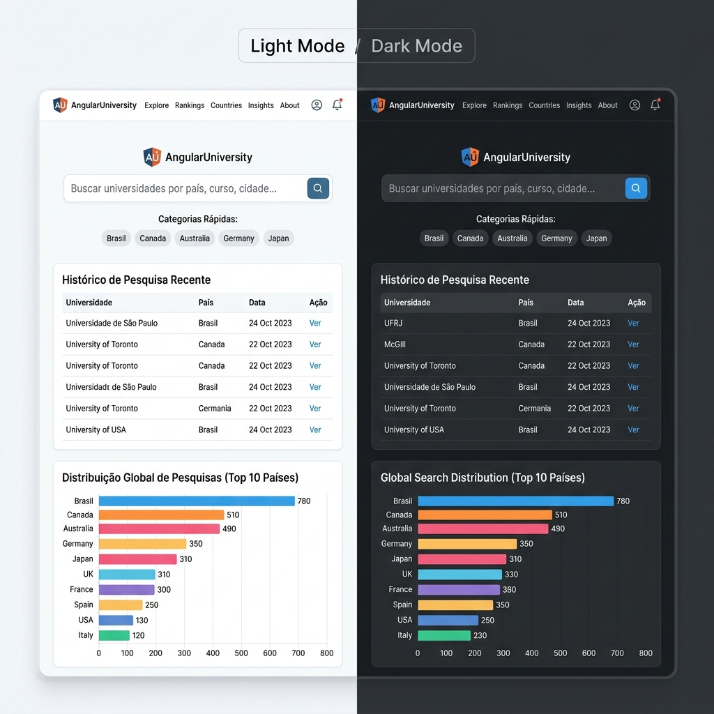
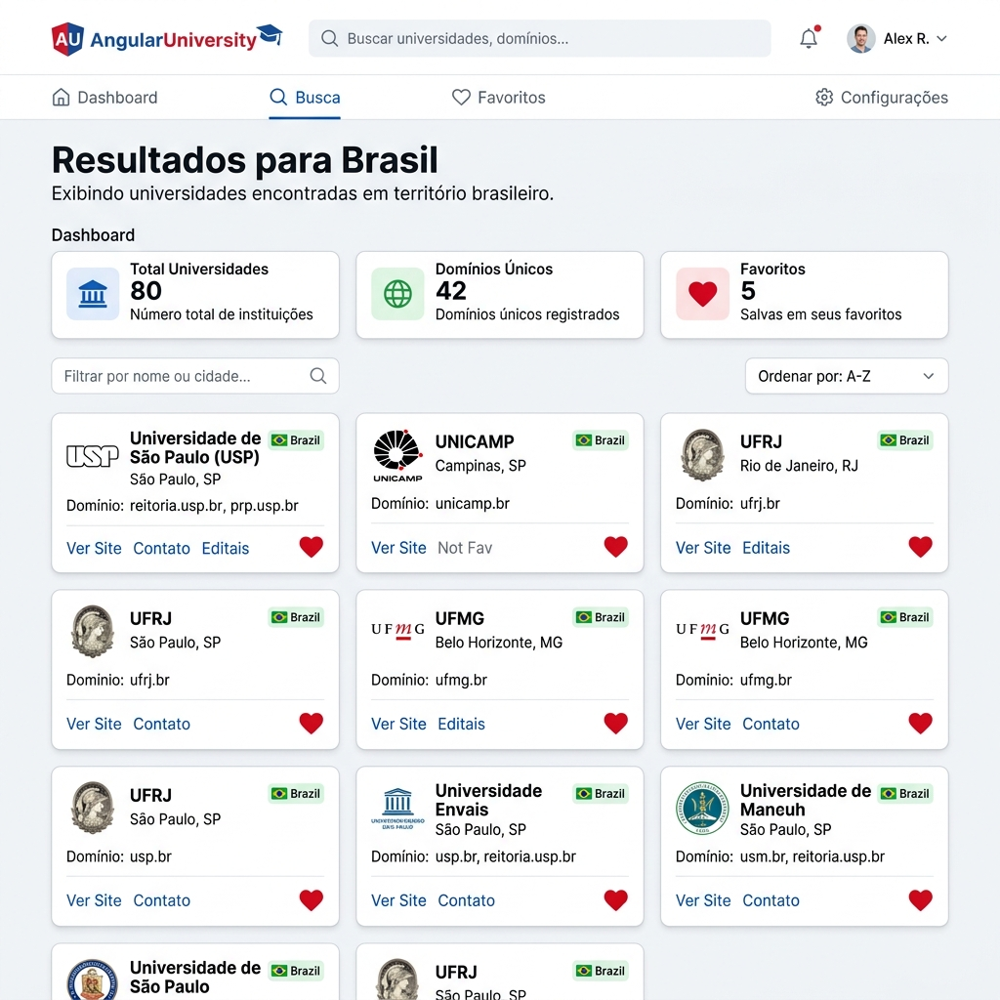
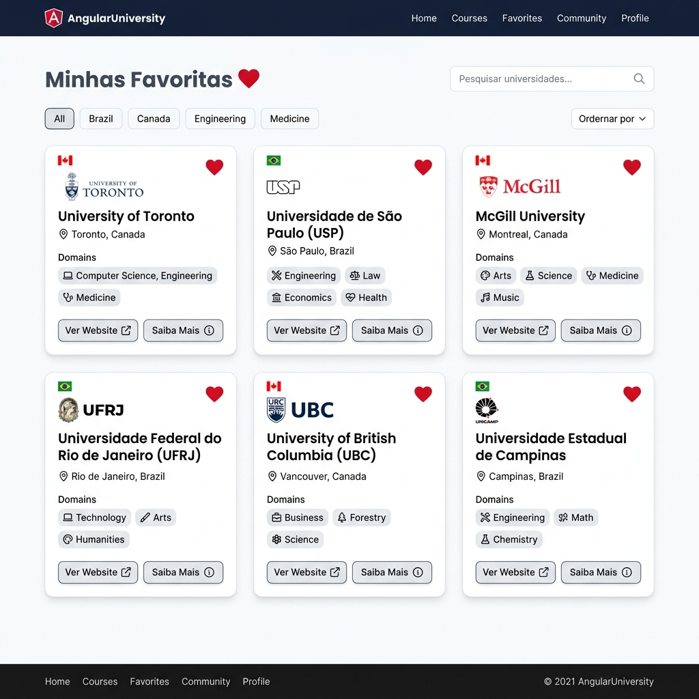

# Angular University – Catálogo Mundial de Universidades

Este projeto é uma aplicação web responsiva construída em **Angular** e **TypeScript** que permite consultar e catalogar informações de universidades de diversos países do mundo em tempo real. Os dados são obtidos dinamicamente da API REST pública do **Hipo Labs**.

---

## 📷 Demonstração Visual (Telas do Sistema)

Aqui estão as visualizações das principais telas projetadas para a aplicação:

### 1. Tela Inicial (Pesquisa e Histórico)
Interface de busca por país, com atalhos de buscas populares, histórico local de pesquisas efetuadas e gráfico dinâmico de distribuição de resultados utilizando Chart.js.



### 2. Tela de Resultados (Listagem e Dashboard)
Painel detalhado exibindo a quantidade de universidades, domínios únicos e quantidade geral de favoritas. Lista paginada dos resultados com filtros de busca local instantânea (sem novas requisições) e ordenação alfabética (A-Z e Z-A).



### 3. Tela de Favoritos (Persistência)
Painel contendo todas as universidades marcadas como favoritas pelo usuário, mantidas permanentemente no navegador via Local Storage e com suporte a filtragem local por texto.



---

## 🎯 Objetivo do Projeto

Desenvolver uma SPA (Single Page Application) modular com Angular, reforçando conceitos fundamentais aplicados na disciplina de Desenvolvimento de Aplicações Web. O projeto contempla:
- Consumo assíncrono de APIs REST com tratamento de erros.
- Integração de bibliotecas externas (Bootstrap e Chart.js) no ecossistema Angular.
- Compartilhamento de dados através de serviços injetáveis.
- Navegação flexível e dinâmica entre telas por meio de rotas parametrizadas.
- Persistência e gerenciamento de estado local por meio de API de Local Storage do navegador.

---

## 🛠️ Tecnologias Utilizadas

A aplicação foi estruturada utilizando a seguinte pilha tecnológica:
- **Framework Principal:** [Angular](https://angular.dev/) (Versão 21)
- **Linguagem:** [TypeScript](https://www.typescriptlang.org/)
- **Protocolo de Comunicação REST:** `HttpClient` do Angular
- **Estilização e Responsividade:** [Bootstrap 5](https://getbootstrap.com/) e [Bootstrap Icons](https://icons.getbootstrap.com/)
- **Visualização de Dados (Gráficos):** [Chart.js](https://www.chartjs.org/)
- **Armazenamento de Dados:** API de `LocalStorage` do navegador web

---

## ⚙️ Instruções de Instalação

Para clonar, instalar as dependências e executar o servidor de desenvolvimento da aplicação em sua máquina local, siga os passos abaixo:

### Pré-requisitos
Certifique-se de possuir o [Node.js](https://nodejs.org/) instalado em seu sistema operacional (recomenda-se versão 18 ou superior).

### Passo 1: Obter o repositório
Clone o repositório utilizando Git ou faça o download dos arquivos:
```bash
git clone <link-do-repositorio>
cd AngularUniversity/AngularUniversity
```

### Passo 2: Instalar as dependências
Execute o instalador de pacotes do npm para carregar todos os módulos declarados no `package.json` (incluindo Bootstrap e Chart.js):
```bash
npm install
```

### Passo 3: Executar o servidor de desenvolvimento
Inicie o servidor de desenvolvimento local. O Angular CLI compilará o projeto em tempo de execução:
```bash
npm run start
```
Após o término da compilação, o terminal informará a URL local. Abra seu navegador em:
👉 **[http://localhost:4200](http://localhost:4200)**

---

## 📂 Estrutura do Sistema

A árvore de arquivos chave do projeto segue as convenções recomendadas pelo guia de estilos oficial do Angular:

```text
AngularUniversity/
├── public/                 # Recursos públicos estáticos da aplicação
│   └── images/             # Imagens mockups incorporadas na documentação
├── src/
│   ├── app/
│   │   ├── components/     # Componentes encapsulados por telas
│   │   │   ├── home/       # Componente de pesquisa, histórico e gráficos
│   │   │   ├── results/    # Componente de tabela de resultados, filtros e paginação
│   │   │   ├── favorites/  # Componente de listagem de favoritos
│   │   │   └── about/      # Componente com objetivos e perfil do desenvolvedor
│   │   ├── models/         # Interfaces e definições de dados de domínio (TypeScript)
│   │   ├── services/       # Serviços injetáveis para requisições e persistência de dados
│   │   ├── app-module.ts   # Módulo principal da aplicação declarando dependências
│   │   ├── app-routing-module.ts # Configurações e caminhos de rotas (SPA)
│   │   ├── app.ts          # Arquivo lógico do componente raiz (com lógica de Dark Mode)
│   │   └── app.html        # Estrutura base da aplicação com o navbar e rodapé
│   ├── index.html          # Ponto de entrada do documento HTML
│   ├── main.ts             # Inicialização (bootstrapping) do módulo da aplicação
│   └── styles.css          # Estilos CSS globais e customizações do Bootstrap/Dark Theme
├── package.json            # Metadados e dependências instaladas
└── angular.json            # Parâmetros de build do Angular Workspace
```
